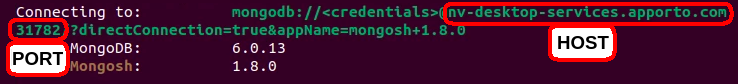

# K9Recruit

K9Recruit is here to facilitate the process of identifying the best
canine candidates for search-and-rescue training.  This powerful 
software package facilitates the CRUD (create, read, update, delete)
functionality built-in to MongoDB through simple queries which allow 
users to easily navigate and manipulate MongoDB databases. 

# Motivation

International rescue-aniimal training company Grazioso Salvare has 
asked us to develop  this middleware package to help them navigate 
the databases of their non-prpfit partners for the best possible 
canine candidates for search-and-rescue training. 

# Getting Started 

1) Import your database file into MongoDB (if it has not already 
been imported). 

2) Add the CRUD.py file to your directory of choice.

3) Open the MongoDB shell (mongosh) by entering the mongosh command
into your terminal as depicted below:

```bash
mongosh
```

## 4) 
Make sure that your connection variables (labeled toward the top 
of the CRUD.py document) are correct including your username (USER), 
password (PASS), host address (HOST), port number (PORT), database 
(DB), and collection (COL).

     If you are unsure of the appropriate hostname and port to use, this 
information will appear after you have opened the mongosh shell, as 
depicted below: 

     


