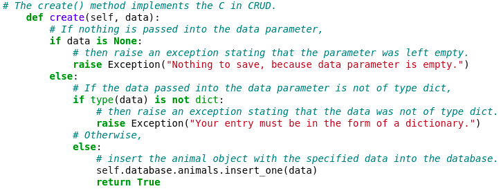
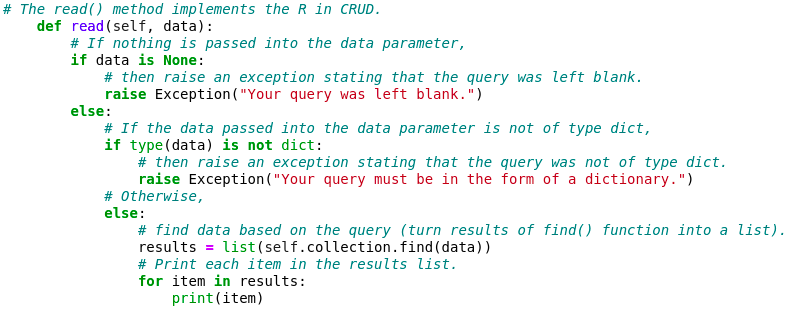
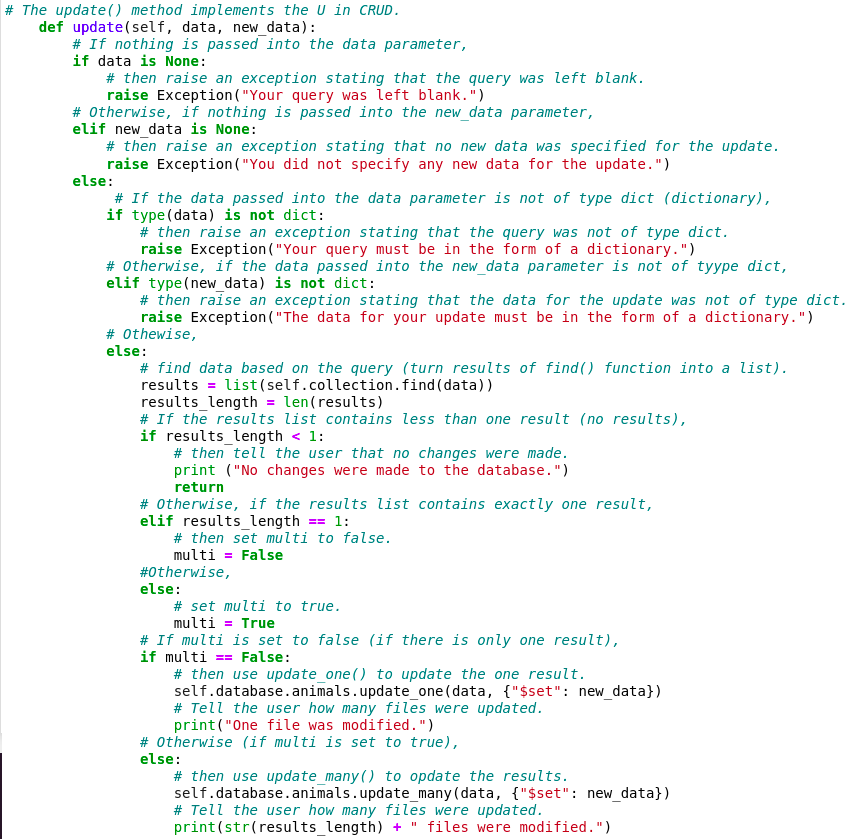
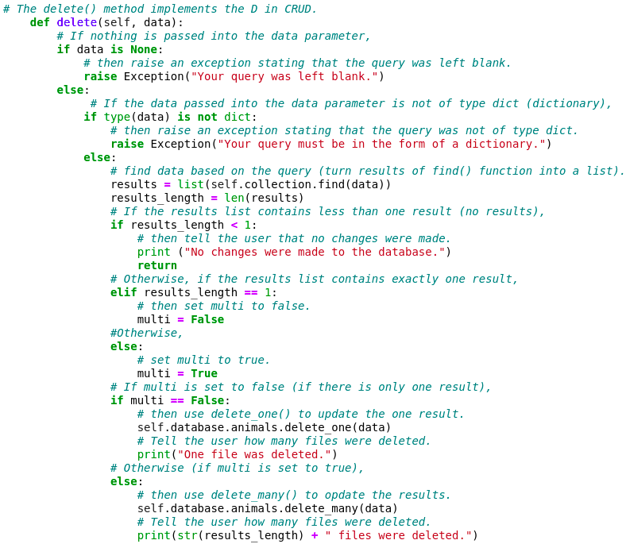

# K9Recruit

K9Recruit facilitates the process of identifying the best
canine candidates for search-and-rescue training.  This powerful 
software package facilitates the CRUD (create, read, update, delete)
functionality built-in to MongoDB through simple queries which allow 
users to easily navigate and manipulate MongoDB databases. 

## Motivation

International rescue-aniimal training company Grazioso Salvare has 
asked us to develop  this middleware package to help them navigate 
the databases of their non-prpfit partners for the best possible 
canine candidates for search-and-rescue training. 

## Getting Started 

### **1)** Import your database file 

Import your data file into MongoDB (if it has not already been imported).  


### **2)** Add the CRUD.py file 

Add the CRUD.py file to your directory of choice.  


### **3)** Open the MongoDB shell

Open mongosh by entering the mongosh command into your terminal as depicted below:

```bash
mongosh
```

### **4)** Set your connection variables

Make sure that your connection variables (labeled toward the top of the CRUD.py document) are correct including your username (USER), password (PASS), host address (HOST), port number (PORT), database (DB), and collection (COL).

If you are unsure of the appropriate hostname and port to use,
this information will appear after you have opened the mongosh shell,
as depicted below: 


If this information does not match what is in your CRUD.py file, 
you will get an error.  


### **5)** Implement your commands

Create a new document or notebook and import AnimalShelter as shown 
below:

```python
from CRUD import AnimalShelter
```

Follow this with the comands which you would like to use to perform CRUD operations on your database.  For specification on how to perform these operations, see the **Usage** section below.


## Installation

Install the latest versions of **Python** and **MongoDB**.

Instructions can be found at the following links:

### Install MongoDB on Linux: 

https://www.mongodb.com/docs/manual/administration/install-on-linux/

### Install MongoBD on Windows

https://www.mongodb.com/docs/manual/tutorial/install-mongodb-on-windows/

### Install MongoDB on Mac:

https://www.mongodb.com/docs/manual/tutorial/install-mongodb-on-os-x/

### Install Python on Linux:

https://www.geeksforgeeks.org/how-to-install-python-on-linux/ 

### Install Python on Windows: 

https://www.python.org/downloads/

### Install Python on Mac: 

https://www.python.org/downloads/macos/ 


## Usage

In order to use this project to interact with MongoDB databases, use the create(), read(), update() and delete() functions to create, delete, and update objects and to query the database. 

### Code Examples

The code snippet below shows the create() method.  As you can see, what is passed into the ‘data’ parameter is used to create animal objects: 



The code in the create() function validates input to make sure that only data of type dictionary (dict) is able to be entered successfully.  This mitigates the possibility of incorrectly formed dictionaries being written to the database, which could result in problems with CRUD operations to the corresponding files.  All of our functions implement input validation of this type.

The code snippet below shows the create() method.  What is passed into the ‘data’ parameter is used to find animal objects within the database: 



The code in the read() function calls MongoDB's find() method to find each animal object which meets the criteria specified in the query, then outputs each animl object within the database.  Since the find() method returns a pointer rather than a list of objects, the read() function turns the elements into items with in a list to facilitate data navigation.

The code snippet below shows the update() function: 



The code in the update() function determines how many results were returned, and uses either update_one() or update_many() as appropriate for the situation.  The number of files which were modified is then printed to the screen.

The code snippet below shows the delete() function:



The delete function


